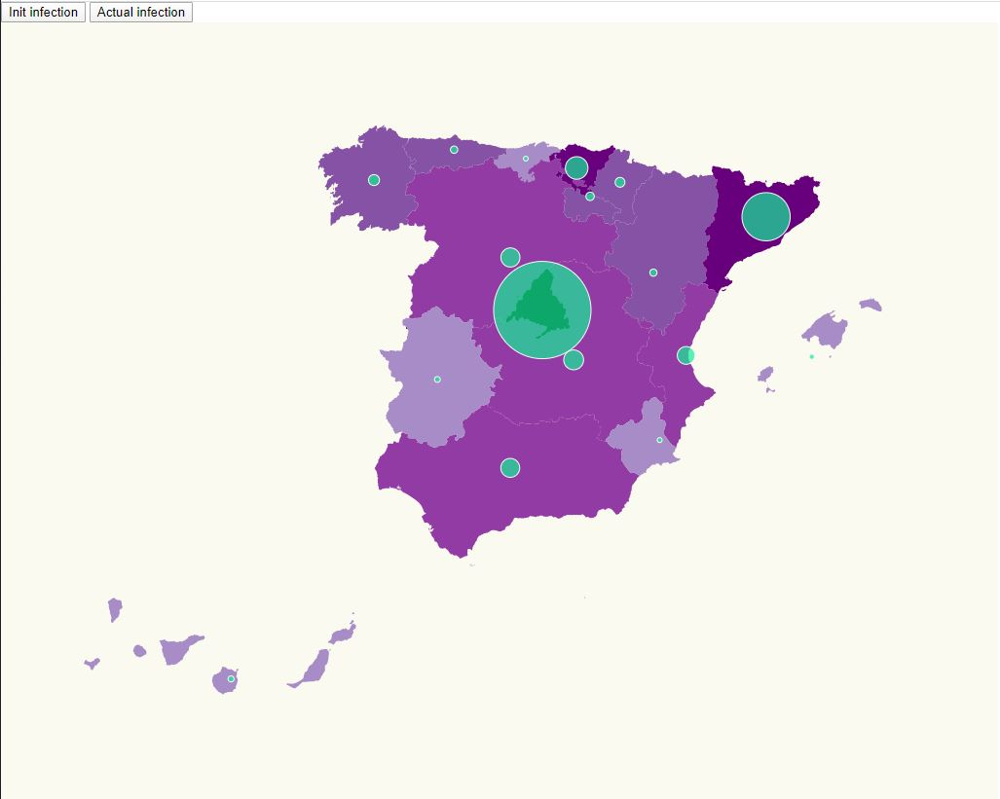

# Map background + Pin location

This result is a join of two exercise, the [Pin Location Scale](https://github.com/jrcaro/map_obligatory) and the [Map Background Scale](https://github.com/Lemoncode/d3js-typescript-examples/tree/master/02-maps/01-scale-background-countries). 

So we start from the previous exercise and modify it with some code.
